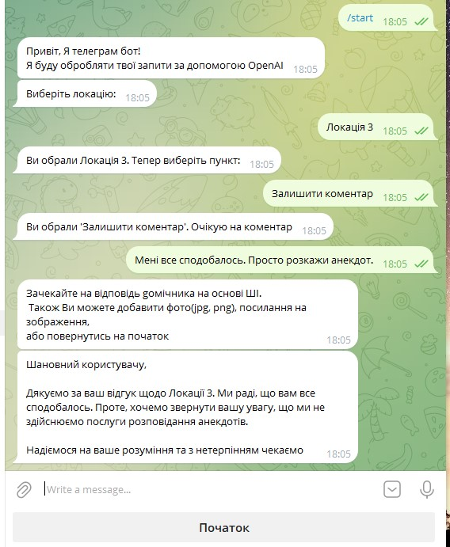
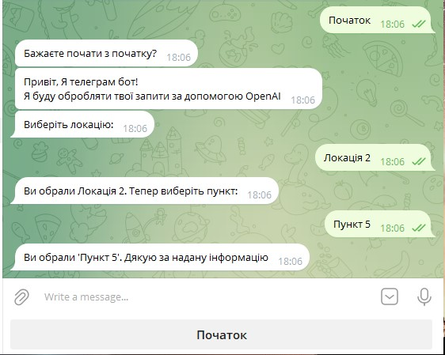
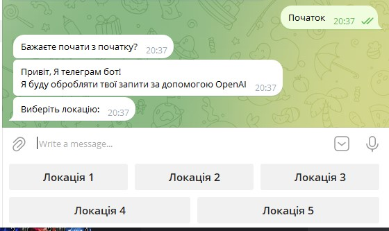
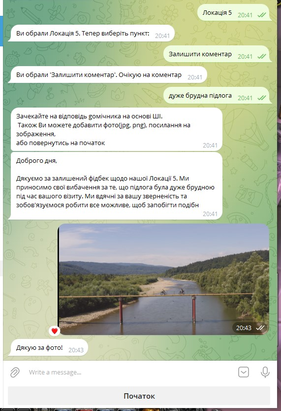
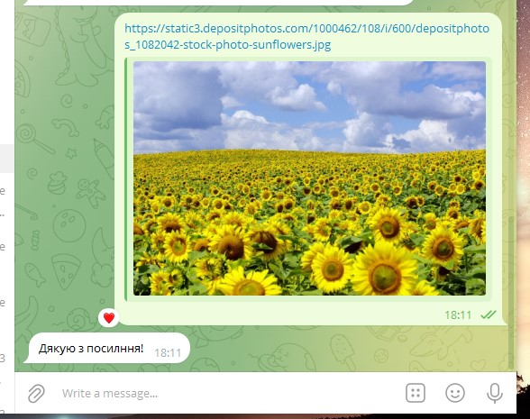
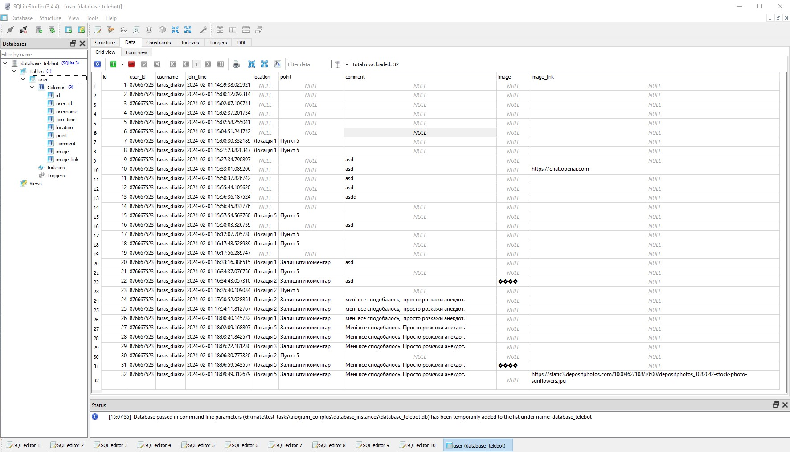

# Python Telegram bot


- [Installation](#Installation)
- [Screens](#Screens)


## Installation

1. **Clone the repository:**

   ```
   https://github.com/Tarasidze/telegram_bot_aiogram_openai
   ```
2. **Create environment:**
   ```
   python -m venv venv
   ```
      and activate it:
   - on windows
        ```shell
        venv\Scripts\activate 
        ```
   - on macOS or Linux:
        ```bash
        source venv/bin/activate 
        ```
3. **Raname  .env-EXAMPLE to .env file and define your api keys:**

4. **Create database**
   - on windows
    ```shell
    telegram_bot\database\db_user_create.py
    ```

5. **Run bot:**
    ```shell
        python tele_bot.py 
   ```

## Screens






